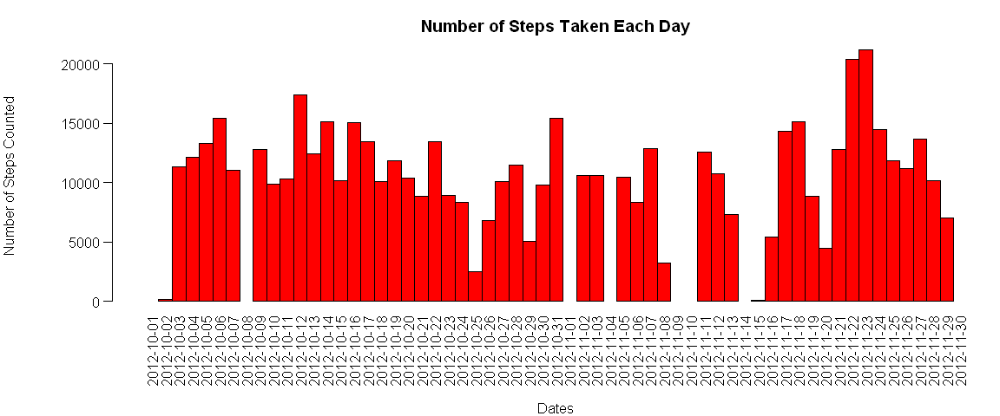
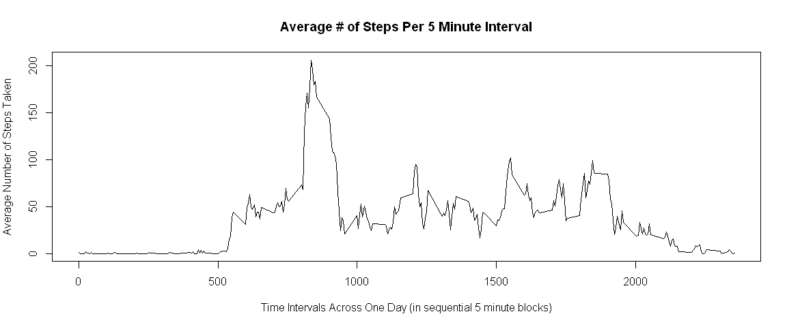
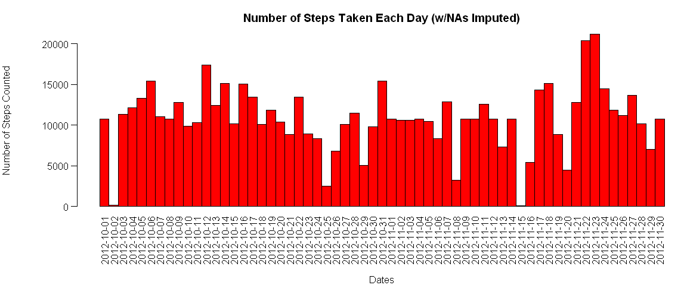
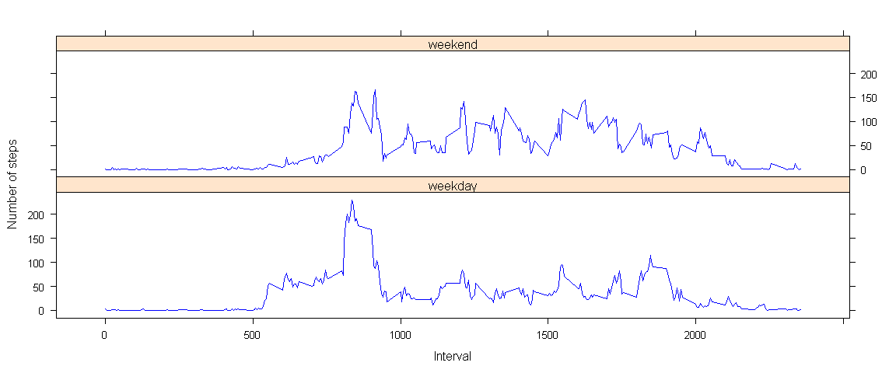

# Reproducible Research:  Peer Assessment 1 Project
Dave Moody  
Sunday, January 10, 2016  

Introduction
============

It is now possible to collect a large amount of data about personal movement using activity monitoring devices such as a Fitbit, 
Nike Fuelband, or Jawbone Up. These type of devices are part of the "quantified self" movement - a group of enthusiasts who take 
measurements about themselves regularly to improve their health, to find patterns in their behavior, or because they are tech geeks. 
But these data remain under-utilized both because the raw data are hard to obtain and there is a lack of statistical methods and software
for processing and interpreting the data.

This assignment makes use of data from a personal activity monitoring device. This device collects data at 5 minute intervals through out
the day. The data consists of two months of data from an anonymous individual collected during the months of October and November, 2012 
and include the number of steps taken in 5 minute intervals each day.

The data for this assignment have been downloaded from the course web site:

Dataset: Activity monitoring data [52K] https://d396qusza40orc.cloudfront.net/repdata%2Fdata%2Factivity.zip

The variables included in this dataset are:

* steps: Number of steps taking in a 5-minute interval (missing values are coded as NA)

* date: The date on which the measurement was taken in YYYY-MM-DD format

* interval: Identifier for the 5-minute interval in which measurement was taken

The dataset is stored in a comma-separated-value (CSV) file and there are a total of 17,568 observations in 
this dataset.

Assignment
==========

###Loading and Preprocessing the Data

       1. Load the data (i.e. read.csv())
       

```r
origData <- read.csv("activity.csv")
```

       2. Process/transform the data (if necessary) into a format suitable for your analysis.
       (Data already processed, so no action taken on this step.)

###What is mean total number of steps taken per day?

       1. Calculate the total number of steps taken per day
       

```r
stepsPerDay <- aggregate(origData$steps, list(origData$date), sum)
colnames(stepsPerDay) <- c("Date","Steps")
stepsPerDay$Steps <- as.numeric(stepsPerDay$Steps)
```

       2. Make a histogram of the total number of steps taken each day.


```r
with(stepsPerDay, {
        par(mar=c(6.75,6.75,3,0), mgp=c(5.75,0.75,0), las=2, oma=c(0,0,0,0))
        barplot(height=Steps, col= "red", main="Number of Steps Taken Each Day",
                xlab="Dates", ylab="Number of Steps Counted", names.arg=Date,
                space=c(0)
        )
})
```

 

       3. Calculate and report the mean and median of the total number of steps taken per day.


```r
meanStepsPerDay <- mean(stepsPerDay$Steps, na.rm=TRUE)
meanStepsPerDay
```

```
## [1] 10766.19
```

```r
medianStepsPerDay <- median(stepsPerDay$Steps, na.rm=TRUE)
medianStepsPerDay
```

```
## [1] 10765
```

###What is the average daily activity pattern?

       1. Make a time series plot (i.e. type = "l") of the 5-minute interval (x-axis) and the average number of 
          steps taken, averaged across all days (y-axis).


```r
meanStepsPerInt <- aggregate(data= origData, steps~interval, mean, na.action=na.omit)
colnames(meanStepsPerInt) <- c("Interval", "AveStepsAcrossDates")
par(mar= c(5,4,4,2), mgp= c(3,1,0))
with(meanStepsPerInt, {plot(x= Interval, y= AveStepsAcrossDates, type= "l", 
                            main= "Average # of Steps Per 5 Minute Interval",
                            xlab= "Time Intervals Across One Day (in sequential 5 minute blocks)",
                            ylab= "Average Number of Steps Taken"
)})
```

 

       2. Which 5-minute interval, on average across all the days in the dataset, contains the maximum number 
          of steps?
       

```r
maxInterval <- meanStepsPerInt[meanStepsPerInt$AveStepsAcrossDates == max(meanStepsPerInt$AveStepsAcrossDates),]
maxInterval
```

```
##     Interval AveStepsAcrossDates
## 104      835            206.1698
```

###Imputing Missing Values

       1. Calculate and report the total number of missing values in the dataset (i.e. the total number of rows
          with NAs)
       

```r
totalNAs <- sum(!complete.cases(origData))
totalNAs
```

```
## [1] 2304
```

       2. Devise a strategy for filling in all of the missing values in the dataset. The strategy does not need 
          to be sophisticated. For example, you could use the mean/median for that day, or the mean for that 5
          minute interval, etc.
       3. Create a new dataset that is equal to the original dataset but with the missing data filled in.


```r
NAimp <- origData 
for (i in 1:nrow(NAimp)) {
             if (is.na(NAimp$steps[i])) {
                NAimp$steps[i] <- meanStepsPerInt[which(NAimp$interval[i] == meanStepsPerInt$Interval),
                ]$AveStepsAcrossDates
             }
}
```

The first six observations of the new dataset look as follows:


```r
head(NAimp)
```

```
##       steps       date interval
## 1 1.7169811 2012-10-01        0
## 2 0.3396226 2012-10-01        5
## 3 0.1320755 2012-10-01       10
## 4 0.1509434 2012-10-01       15
## 5 0.0754717 2012-10-01       20
## 6 2.0943396 2012-10-01       25
```

       4. Make a histogram of the total number of steps taken each day and Calculate and report the mean and 
          median total number of steps taken per day. Do these values differ from the estimates from the first  
          part of the assignment? What is the impact of imputing missing data on the estimates of the total 
          daily number of steps?


```r
stepsPerDayImp <- aggregate(NAimp$steps, list(NAimp$date), sum)
colnames(stepsPerDayImp) <- c("Date","Steps")
with(stepsPerDayImp, {
        par(mar=c(6.75,6.75,3,0), mgp=c(5.75,0.75,0), las=2, oma=c(0,0,0,0))
        barplot(height=Steps, col= "red", main="Number of Steps Taken Each Day (w/NAs Imputed)",
                xlab="Dates", ylab="Number of Steps Counted", names.arg=Date,
                space=c(0)
        )
})
```

 

The mean and median steps per day after imputing the data are as follows:


```r
meanStepsPerDayImp <- mean(stepsPerDayImp$Steps)
meanStepsPerDayImp
```

```
## [1] 10766.19
```

```r
medianStepsPerDayImp <- median(stepsPerDayImp$Steps)
medianStepsPerDayImp
```

```
## [1] 10766.19
```

The impact of imputing the missing values on the mean steps per day results in no change.  The impact of 
imputing the missing values on the median steps per day results only in a slight change of just over 1 step per 
day.

###Are there differences in activity patterns between weekdays and weekends?

       1. Create a new factor variable in the dataset with two levels - "weekday" and "weekend" indicating 
          whether a given date is a weekday or weekend day.


```r
typeOfDay <- data.frame(sapply(X= NAimp$date, FUN= function(date)
                        if (weekdays(as.Date(date)) %in% c("Saturday", "Sunday")) {
                                day <- "weekend"
                        } else {
                                day <- "weekday"
                        }
                        ))
colnames(typeOfDay) <- c("TypeOfDay")                    
NAimpWithDayType <- cbind(NAimp, typeOfDay)
```

The first six rows of the new dataset look as follows:


```r
head(NAimpWithDayType)
```

```
##       steps       date interval TypeOfDay
## 1 1.7169811 2012-10-01        0   weekday
## 2 0.3396226 2012-10-01        5   weekday
## 3 0.1320755 2012-10-01       10   weekday
## 4 0.1509434 2012-10-01       15   weekday
## 5 0.0754717 2012-10-01       20   weekday
## 6 2.0943396 2012-10-01       25   weekday
```

       2. Make a panel plot containing a time series plot (i.e. type = "l") of the 5-minute interval (x-axis) 
          and the average number of steps taken, averaged across all weekday days or weekend days (y-axis). See 
          the README file in the GitHub repository to see an example of what this plot should look like using 
          simulated data.  


```r
meanStepsPerIntDayType <- aggregate(data= NAimpWithDayType, steps ~ TypeOfDay + interval, mean)
library("lattice")
xyplot( type="l", col= "blue", data= meanStepsPerIntDayType, steps ~ interval | TypeOfDay, xlab= "Interval",
        ylab= "Number of steps", layout=c(1,2))
```

 


